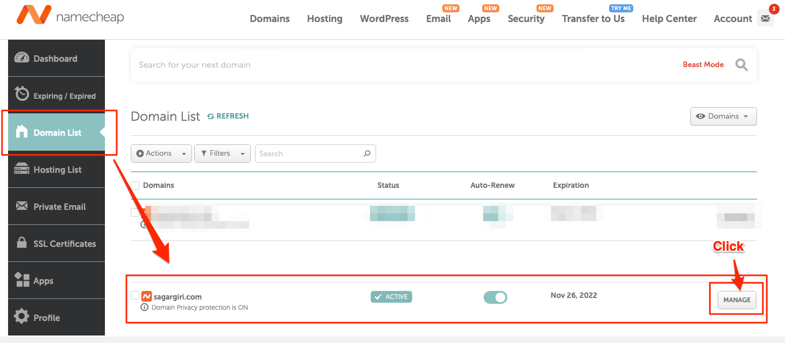
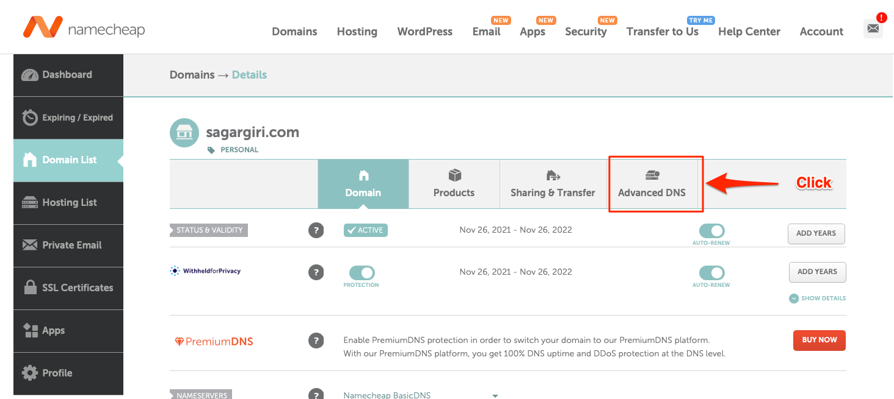
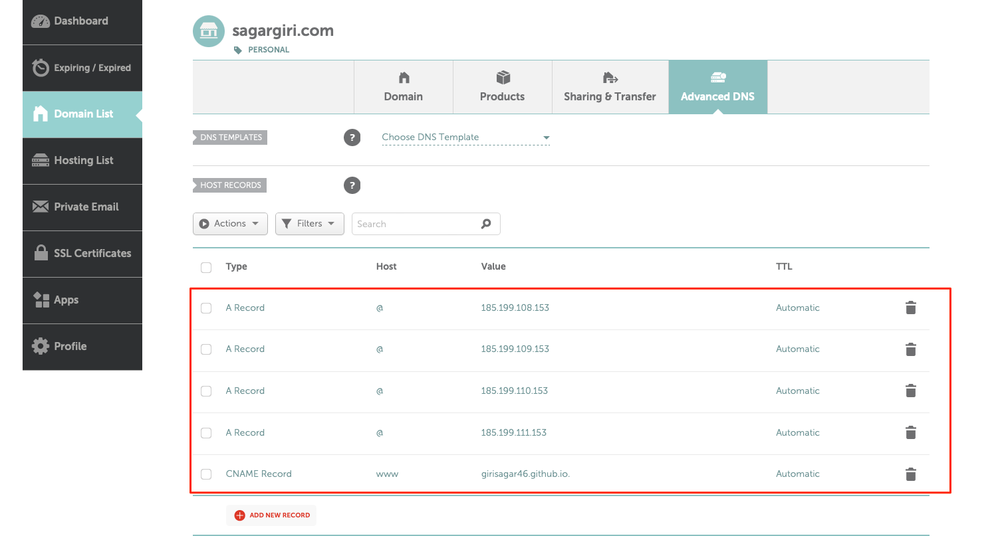
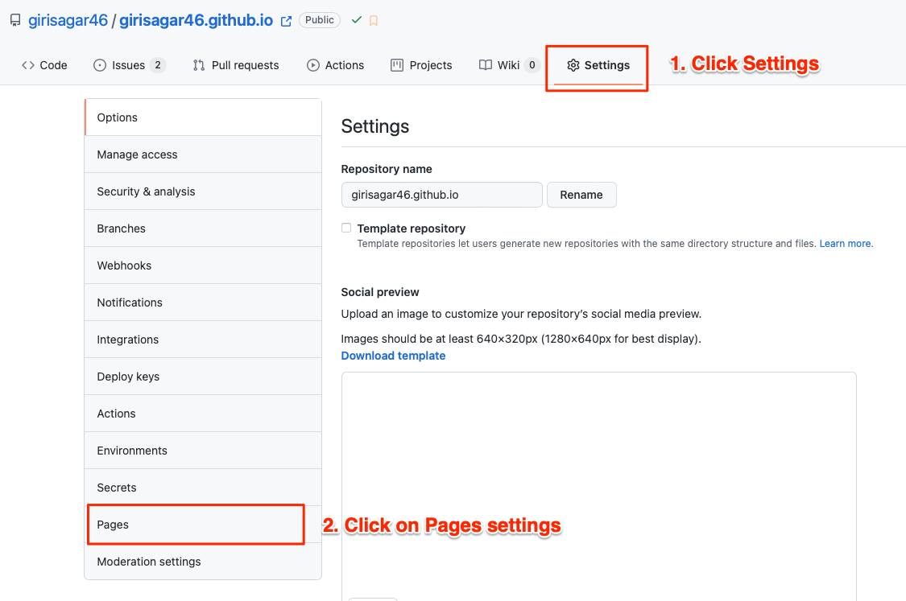
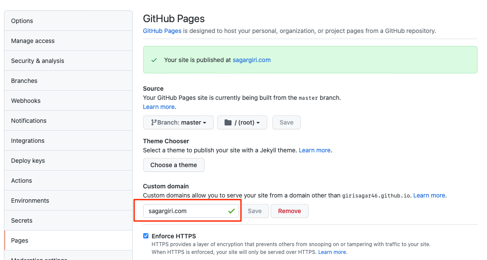

Title: How to setup custom domain for github.io pages?
Date: 2021-11-27 23:8
Modified: 2021-11-27 23:8
Category: how-to, tutorial
Tags: domain, dns, github, hosting, how-to, setup, website
Slug: how-to-setup-custom-domain-for-github-pages
Summary: In this blog post , I will show you how to set up custom domain for any github.io pages.

> Assumption: For this tutorial, I am assuming you already have bought a domain name from any domain name provider and you already have a github.io pages setup like this [girisagar46.github.io](https://girisagar46.github.io).
> Also in this post, I'm using [namecheap](https://www.namecheap.com) and setting up Apex domain name.

This blog is hosted in github pages. When you visit [sagargiri.com](https://sagargiri.com), the web pages that you see are actually hosted in github.io, and you can see the source code of this blog [here](https://github.com/girisagar46/girisagar46.github.io/). But, how my domain `sagargiri.com` is pointing to `girisagar46.github.io` ? How do we configure such settings? All of these questions are answered in this blog post.

## Step-by-step guide

### Step 1: Buy the domain name.

If you do not have a domain name yet, you can use any of the domain name providers. For example, you can use [namecheap](https://www.namecheap.com), [godaddy](https://www.godaddy.com) or [domains.google](https://domains.google).
I bought mine from [namecheap](https://www.namecheap.com) during black friday sale.

Now that you have bought the domain name, you need to set up the DNS records. Which we'll do in second step.

### Step 2: Set up DNS records.

In your domain name provider page you'll have an option to set up DNS records. In the case of namecheap, you'll first have to click the `MANAGE` button in the `Domain List` page as shown in screenshot below.



Then click the `Advanced DNS` button as shown in screenshot below.



In the `HOST RECORDS` section, you need to add the following DNS records as shown in screenshot below.



Here are the IP addresses list for `A` record for you to copy and paste.

```
185.199.108.153
185.199.109.153
185.199.110.153
185.199.111.153
```

Also DO NOT forget to add the `CNAME` record as shown in screenshot.
You need to add your own github.io domain name.

Once you have added the DNS records, you can now go to your GitHub page settings to actually map the CNAME.

### Step 3. Configure your USERNAME.github.io page settings

Go to your github.io repository settings and click on the `Settings` button and then click on the `Pages` button as shown in screenshot below.



This will lead you to the GitHub.io settings for GitHub pages.

In the `Pages` section, you need to add the following domain name as shown in screenshot below.



This will commit a new file called `CNAME` to your github.io repository. You can verify that later on. Also do not forget to check the `Enforce HTTPS ` checkbox. This will provide you SSL certificate for your domain name. Once you see the green tick mark in your domain name in the `Pages` section, you're good tpo go.

But, be aware that the DNS propagation takes some time. Take rest, drink a cup of coffee, browse other articles in this website and wait for a while.

After some time, you can visit your domain name, and you will see the github.io pages are mapped to your domain name.

You can also verify all this is working using the `dig` command

```
╰─$ dig sagargiri.com +noall +answer -t A

; <<>> DiG 9.10.6 <<>> sagargiri.com +noall +answer -t A
;; global options: +cmd
sagargiri.com.		1799	IN	A	185.199.109.153
sagargiri.com.		1799	IN	A	185.199.110.153
sagargiri.com.		1799	IN	A	185.199.111.153
sagargiri.com.		1799	IN	A	185.199.108.153
```

Here you can see that my domain is pointing to the A records that we have set up in the Step 2.

References:
https://docs.github.com/en/pages/getting-started-with-github-pages/about-github-pages
https://docs.github.com/en/pages/configuring-a-custom-domain-for-your-github-pages-site
