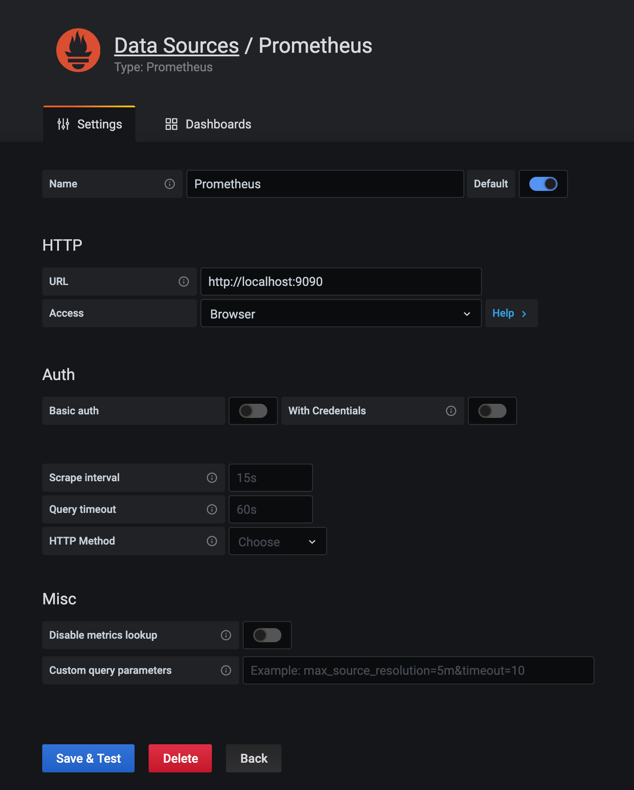
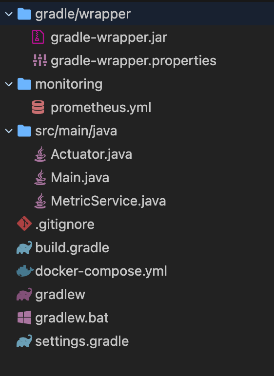
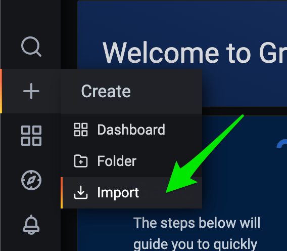
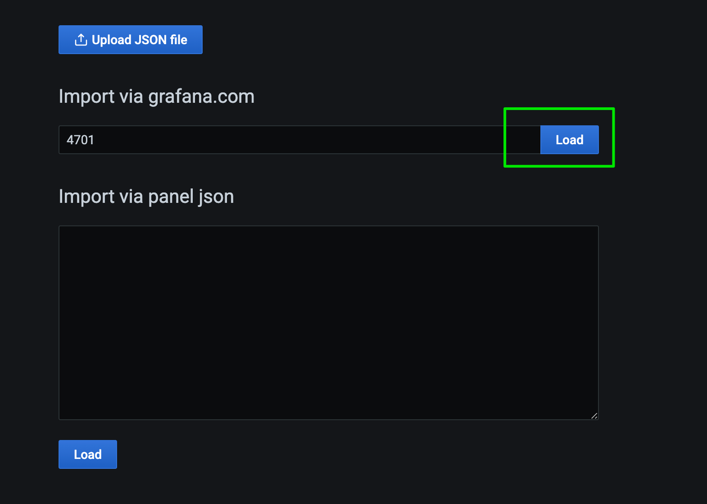
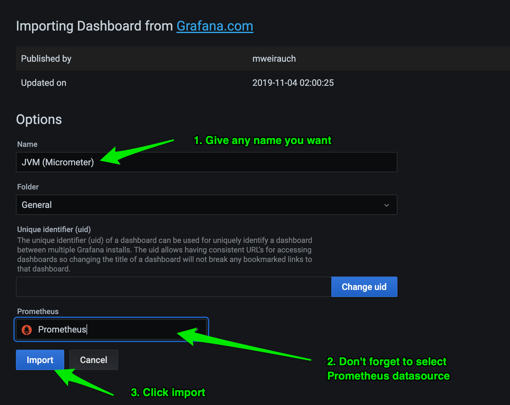
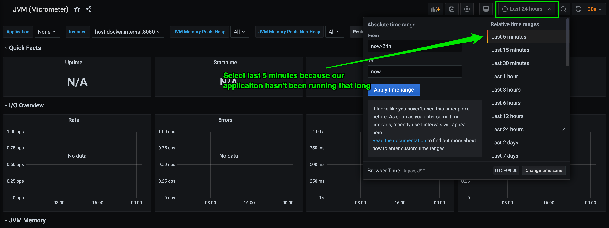
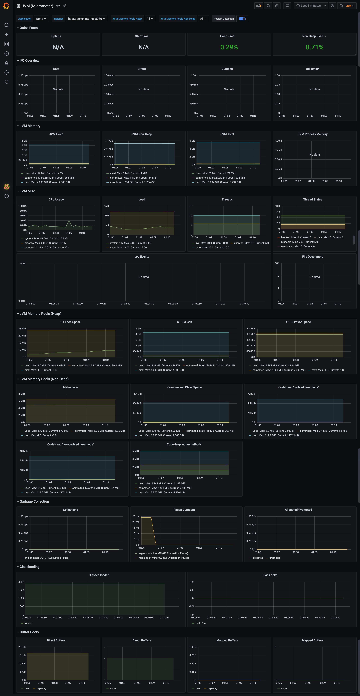

Title: Instrument Your Java Code with Micrometer, Prometheus, and Grafana.
Date: 2020-12-31 15:33
Modified: 2020-12-31 15:33
Category: tutorial
Tags: tutorial, java, micrometer, prometheus
Slug: java-instrumentation-with-micrometer
Summary: In this blog tutorial, let's instrument your Java SE code with Prometheus using Micrometer

> Micrometer provides a simple facade over the instrumentation clients for the most popular monitoring systems, allowing you to instrument your JVM-based application code without vendor lock-in. Think SLF4J, but for metrics. - https://micrometer.io/

I'm assuming you have some Java code, and you'd like to instrument it (measure how well it's performing, what is the heap space in current state, are there any exceptions. etc)

With this 3 steps, you'll be up and running in no time.

# Step 1: Setup the development environment

Here I am using [Docker](https://www.docker.com/) and [Docker compose](https://docs.docker.com/compose/) to set up the environment for simplicity purposes. If you do not have these in your machine, I highly recommend you to install it so that you can follow along.

> The full source code is available here: https://github.com/girisagar46/prome-java

First and foremost, I will set [Prometheus](https://prometheus.io/) and [Grafana](https://grafana.com/) in my `docker-compose.yml` file.

The `docker-compose.yml` file looks like this:

    ```yaml
    version: "3.8"

    services:
      # The prometheus service
      prometheus:
        # Using the latest image
        image: prom/prometheus
        # Setting the custom container name. You can set anything you like. It'll show up if you do `docker-compose ps`
        container_name: prometheus

        # Mount the volume so that we can use custom metrics endpoints and persistent data storage so that when service is restarted, the collected data will be preserved
        volumes:
          - ./monitoring/prometheus.yml:/etc/prometheus/prometheus.yml
          - ./data/prometheus:/data
        command:
          - "--config.file=/etc/prometheus/prometheus.yml"
          - "--storage.tsdb.path=/data"
        # Exposing default port 9090 so that I can access it from web-browser without port forwarding
        ports:
          - "9090:9090"
        restart: always

      grafana:
        image: grafana/grafana
        container_name: grafana
        volumes:
          - ./grafana:/var/lib/grafana
          - ./grafana/datasources:/etc/grafana/datasources
          - ./grafana/dashboards:/etc/grafana/dashboard
        ports:
          - "3000:3000"
        restart: always
    ```

Since we're mounting `/monitoring/prometheus.yml` into prometheus service, let's create the directory `monitoring` and create a file `prometheus.yml` inside the `monitoring` directory.

The contents of the `prometheus.yml` looks like this:

    ```yaml
    global:
      scrape_interval: 10s
      evaluation_interval: 10s

    scrape_configs:
      - job_name: "prometheus"
        static_configs:
          - targets: ["127.0.0.1:9090"]

      - job_name: "prome-java"
        metrics_path: "/metrics"
        scrape_interval: 5s
        static_configs:
          # Using "host.docker.internal:8080" because the Java application will be running on localhost at port 8080
          - targets: ["host.docker.internal:8080"]
            labels:
              alias: "java-app"
    ```


Once the `docker-compose.yml` is ready, start the services

    ```bash
    docker-compose up
    ```

And when the services are up, visit [http://localhost:9090/](http://localhost:9090/). You'll see something like this:


And if you navigate to [http://localhost:9090/targets](http://localhost:9090/targets) (`Status` dropdown -> `Targets`), you'll see something like this:


As you can see there's an error message that says:

    ```
    Get "http://host.docker.internal:8080/metrics": dial tcp 192.168.65.2:8080: connect: connection refused
    ```

because our Java application is not running at the moment. We'll fix this a little letter.

If you visit [http://localhost:3000/](http://localhost:3000/), you'll see the Grafana login page:


Use the default username: `admin` and password `admin` to get inside the Grafana dashboard. When asked to change password, skip it as it's just a local development environment. Obviously in production, this has to be more sure by enabling the login by Gmail or any other OAUTH mechanism.

Now you need to add Prometheus data source so that our Grafana can get the piece of the metrics we're exposing.
To add the datasource directly go to [http://localhost:3000/datasources](http://localhost:3000/datasources)

Then click on **Add data source** button and fill up the form as shown in the screenshot below.




# Step 2: Expose metrics from your Java application

1. Create `MetricSercive` class which will provide the singleton instance of `PrometheusMeterRegistry`
    ```java
    // Just a service class which will provide the instance of PrometheusMeterRegistry
    public class MetricService {

      private static PrometheusMeterRegistry prometheusMeterRegistry = null;

      public static PrometheusMeterRegistry getRegistry() {
        if (prometheusMeterRegistry == null) {
          prometheusMeterRegistry = new PrometheusMeterRegistry(PrometheusConfig.DEFAULT);
        }
        return prometheusMeterRegistry;
      }
    }
    ```

1. Create HTTP metric endpoint where prometheus can go to scrape the metrics. As you can see in the `prometheus.yml` file we've defined `metrics_path: "/metrics"`. So, let's create HTTP endpoint. I'll add this in the `Actuator.java` file:

    ```java
    public class Actuator {

      private final PrometheusMeterRegistry prometheusMeterRegistry;
      private HttpServer server;

      public Actuator(
          PrometheusMeterRegistry prometheusMeterRegistry) {
        // inject PrometheusMeterRegistry to Actuator class because we're using Prometheus
        this.prometheusMeterRegistry = prometheusMeterRegistry;

        // These classes are for exposing JVM specific metrics
        new ClassLoaderMetrics().bindTo(this.prometheusMeterRegistry);
        new JvmMemoryMetrics().bindTo(this.prometheusMeterRegistry);
        new JvmGcMetrics().bindTo(this.prometheusMeterRegistry);
        new ProcessorMetrics().bindTo(this.prometheusMeterRegistry);
        new JvmThreadMetrics().bindTo(this.prometheusMeterRegistry);
      }

      public void start() throws IOException {
        // create HTTP server endpoint which will expose endpoint to /metrics
        server = HttpServer.create(new InetSocketAddress(8080), 0);
        server.setExecutor(java.util.concurrent.Executors.newFixedThreadPool(2));

        server.createContext(
            "/metrics",
            httpExchange -> {
              String response = this.prometheusMeterRegistry.scrape();
              httpExchange.sendResponseHeaders(HttpURLConnection.HTTP_OK, response.getBytes().length);
              try (OutputStream os = httpExchange.getResponseBody()) {
                os.write(response.getBytes());
              }
            });

        server.start();
      }

      public void stop() {
        server.stop(0);
      }
    }
    ```

1. Create the Main class (the entry point to our application)

    ```java
   public class Main {

      public static void main(String[] args) {
        Actuator actuator = new Actuator(MetricService.getRegistry());
        try {
          actuator.start();
        } catch (IOException ioException) {
          actuator.stop();
        }
      }
    }
    ```

At this point, the source code directory looks like this:



Now if you run your application (Execute Main.java) and go to [http://localhost:8080/metrics](http://localhost:8080/metrics), you'll see following output:

    ```
    ...
    # HELP jvm_gc_live_data_size_bytes Size of long-lived heap memory pool after reclamation
    # TYPE jvm_gc_live_data_size_bytes gauge
    jvm_gc_live_data_size_bytes 0.0
    # HELP jvm_buffer_count_buffers An estimate of the number of buffers in the pool
    # TYPE jvm_buffer_count_buffers gauge
    jvm_buffer_count_buffers{id="mapped - 'non-volatile memory'",} 0.0
    jvm_buffer_count_buffers{id="mapped",} 0.0
    jvm_buffer_count_buffers{id="direct",} 2.0
    # HELP jvm_memory_used_bytes The amount of used memory
    # TYPE jvm_memory_used_bytes gauge
    ...
    ```

Which means your Java application is exposing metrics for the Prometheus to grab.

# Step 3: Visualize the exposed metrics in Grafana

Since, we're only exposing JVM metrics for now let's see those exposed metrics on Grafana through a sweet dashboard.

Let's import the [Micrometer grafana official dashboard](https://grafana.com/grafana/dashboards/4701). The ID of the grafana dashboard is `4701`. So, let's import the dashboard to Grafana.

Click on the **Import** button which is shown in the screenshot below.



Type `4701` in the input field `Import via grafana.com` and click **Load** button.



Once, you click load, you'll see this page. Follow the 3 steps shown in the screenshot.



Now your dashboard is imported, change the date range to view recent data.



Congratulations!! your dashboard is fully functional and ready to use.



You can play with Prometheus and Grafana as much as you like because everything is running in local. Try creating some alerts, Prometheus rules, write some PROMQL and expose some other metrics with Micrometer.

If you want to take this to production, you can do it in various ways. Using K8s, using 3rd party service, hosting your own, using AWS managed service, etc. There are plethora of options, and you can choose any depending on your cost and requirements.

# Going further
Now the basic setup is done, the metrics world does not stop here. It's a vast ocean. Here are some further additional resources which will help you going forward.

1. https://micrometer.io/docs/concepts
1. https://prometheus.io/docs/prometheus/latest/getting_started/
1. https://prometheus.io/docs/prometheus/latest/querying/basics/
1. [Video: PromQL for Mere Mortals](https://www.youtube.com/watch?v=hTjHuoWxsks)
1. [Video: The 4 Types Of Prometheus Metrics](https://www.youtube.com/watch?v=nJMRmhbY5hY)
1. https://www.robustperception.io/blog
1. https://grafana.com/tutorials/
1. https://github.com/prometheus/client_java
1. https://www.reddit.com/r/PrometheusMonitoring -> Reddit community
1. https://www.reddit.com/r/grafana -> Reddit community
1. https://slofile.com/slack/micrometer-metrics -> Official Slack channel for Micrometer (Join and ask any questions related to Prometheus, Grafana and Micrometer)
