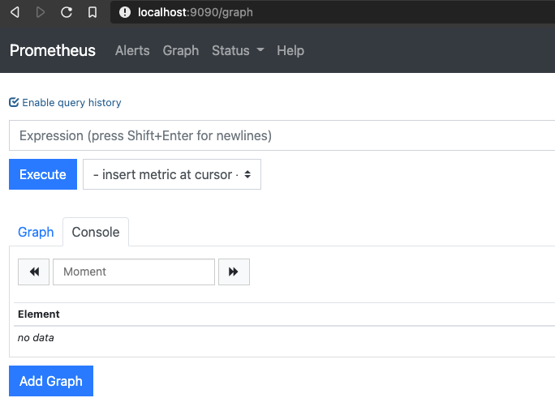
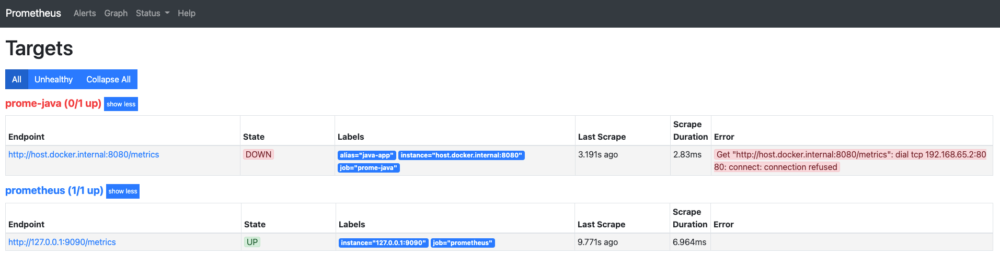
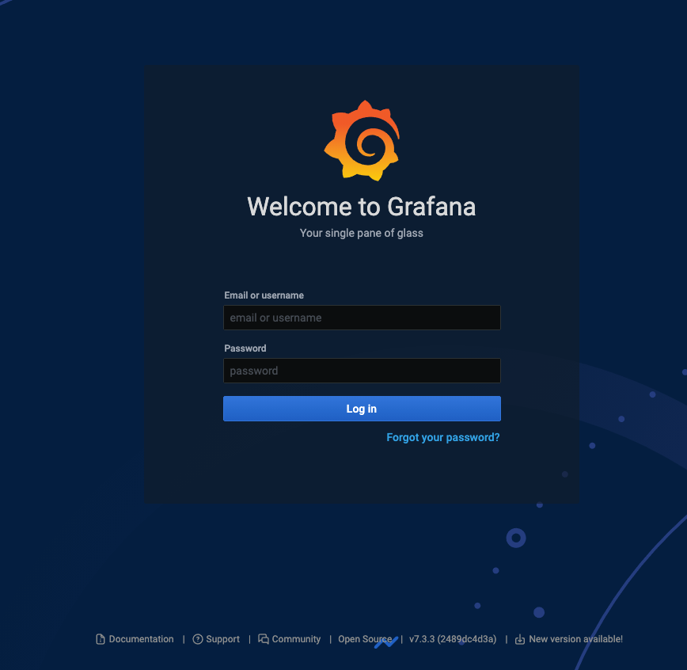

Title: Instrument Your Java Code with Micrometer, Prometheus, and Grafana.
Date: 2020-12-13 15:33
Modified: 2020-12-13 15:33
Category: tutorial
Tags: tutorial, java, micrometer, prometheus
Slug: java-instrumentation-with-micrometer
Status: Draft
Summary: In this blog tutorial, let's instrument your Java SE code with Prometheus using  Micrometer

> Micrometer provides a simple facade over the instrumentation clients for the most popular monitoring systems, allowing you to instrument your JVM-based application code without vendor lock-in. Think SLF4J, but for metrics. - https://micrometer.io/

I'm assuming you have some Java code and you'd like to instrument it (measure how well it's performing, what is the heap space in current state, are there any exceptions. etc)

# First, let's setup a development environment

Here I am using [Docker](https://www.docker.com/) and [Docker compose](https://docs.docker.com/compose/) to set up the environment for simplicity purposes. If you do not have these in your machine, I highly recommend you to install it so that you can follow along.

First and foremost, I will set [Prometheus](https://prometheus.io/) and [Grafana](https://grafana.com/) in my `docker-compose.yml` file.

The `docker-compose.yml` file looks like this:

    ```yaml
    version: "3.8"

    services:
      # The prometheus service
      prometheus:
        # Using the latest image
        image: prom/prometheus
        # Setting the custom container name. You can set anything you like. It'll show up if you do `docker-compose ps`
        container_name: prometheus

        # Mount the volume so that we can use custom metrics endpoints and persistent data storage so that when service is restarted, the collected data will be preserved
        volumes:
          - ./monitoring/prometheus.yml:/etc/prometheus/prometheus.yml
          - ./data/prometheus:/data
        command:
          - "--config.file=/etc/prometheus/prometheus.yml"
          - "--storage.tsdb.path=/data"
        # Exposing default port 9090 so that I can access it from web-browser without port forwarding
        ports:
          - "9090:9090"
        restart: always

      grafana:
        image: grafana/grafana
        container_name: grafana
        volumes:
          - ./grafana:/var/lib/grafana
          - ./grafana/datasources:/etc/grafana/datasources
          - ./grafana/dashboards:/etc/grafana/dashboard
        ports:
          - "3000:3000"
        restart: always
    ```

Since we're mounting `/monitoring/prometheus.yml` into prometheus service, let's create the directory `monitoring` and create a file `prometheus.yml` inside the `monitoring` directory.

The contents of the `prometheus.yml` looks like this:

    ```yaml
    global:
      scrape_interval: 10s
      evaluation_interval: 10s

    scrape_configs:
      - job_name: "prometheus"
        static_configs:
          - targets: ["127.0.0.1:9090"]

      - job_name: "prome-java"
        metrics_path: "/metrics"
        scrape_interval: 5s
        static_configs:
          # Using "host.docker.internal:8080" because the Java application will be running on localhost at port 8080
          - targets: ["host.docker.internal:8080"]
            labels:
              alias: "java-app"
    ```


Once the `docker-compose.yml` is ready, start the services

    ```bash
    docker-compose up
    ```

And when the services are up, visit [http://localhost:9090/](http://localhost:9090/). You'll see something like this:


And if you navigate to [http://localhost:9090/targets](http://localhost:9090/targets) (`Status` dropdown -> `Targets`), you'll see something like this:


As you can see there's an error message that says:

    ```
    Get "http://host.docker.internal:8080/metrics": dial tcp 192.168.65.2:8080: connect: connection refused
    ```

because our Java application is not running at the moment. We'll fix this a little letter.

If you visit [http://localhost:3000/](http://localhost:3000/), you'll see the Grafana login page:



Use the default username: `admin` and password `admin` to get inside the Grafana dashboard. When asked to change password, skip it as it's just a local development envionment. Obviously in production, this has to be more sure by enabling the login by Gmail or any other OAUTH mechanism.
